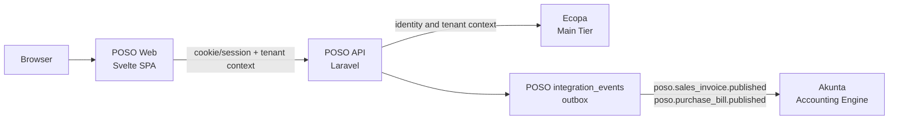

# POSO Architecture

Status: phase 1 scaffold, 2026-05-03.

## Tier boundary

POSO is not Akunta.

- Ecopa is the main tier: login, tenant, user, app access, and identity context.
- POSO is the second tier: sales, purchases, customers, suppliers, product-facing workflow.
- Akunta is the accounting tier: double entry, journals, posting, audit of accounting records.

POSO records operational documents and emits integration events. Akunta decides how those events become double-entry accounting records.

Entity context is shared, not duplicated. POSO reads the same RBAC `entities`
source used by Akunta and respects the cross-app `akunta_entity` cookie so
switching entity in one tier can be reflected by the other tier.

## Runtime topology



## Phase 1 API contract

POSO exposes:

- `GET /api/v1/me`
- `POST /api/v1/context/entity`
- `GET /api/v1/accounting/journal-templates`
- `GET /api/v1/accounting/accounts`
- `GET /api/v1/sales/invoices`
- `POST /api/v1/sales/invoices`
- `GET /api/v1/purchases/bills`
- `POST /api/v1/purchases/bills`

When a sales invoice or purchase bill is created as `published`, POSO writes an `integration_events` outbox row:

```json
{
  "event_type": "poso.sales_invoice.published",
  "source_app": "poso",
  "source_id": "01...",
  "tenant_id": "tenant-from-ecopa",
  "journal_request": {
    "mode": "akunta_journal_template",
    "target_app": "akunta",
    "entity_id": "01...",
    "journal_template": {
      "id": "01...",
      "code": "SAMPLE-SALES-PPN",
      "name": "Penjualan Tunai + PPN 11%",
      "source": "akunta",
      "snapshot": {
        "lines": [
          {
            "line_no": 1,
            "side": "debit",
            "account": {
              "code": "1101",
              "name": "Kas"
            }
          }
        ]
      }
    },
    "instantiate": {
      "date": "2024-05-23",
      "reference": "INV/2024/05/0010",
      "idempotency_key": "poso:sales_invoice:01...:journal",
      "amounts": {
        "subtotal": "12500000.00",
        "tax_total": "1375000.00",
        "grand_total": "13875000.00"
      }
    }
  },
  "document": {
    "type": "sales_invoice",
    "number": "INV/2024/05/0010",
    "date": "2024-05-23",
    "totals": {
      "subtotal": "12500000.00",
      "discount_total": "0.00",
      "tax_total": "1375000.00",
      "grand_total": "13875000.00"
    },
    "lines": []
  }
}
```

Published transactions require a user-selected Akunta journal template. POSO
reads those references from the configured Akunta COA/template connection,
stores the selected template snapshot on the transaction, and sends the
`journal_request` in the outbox payload.

The dispatcher that actually POSTs the outbox to Akunta is intentionally left for the next phase, after the Akunta webhook contract is finalized by the separate Akunta workstream.
